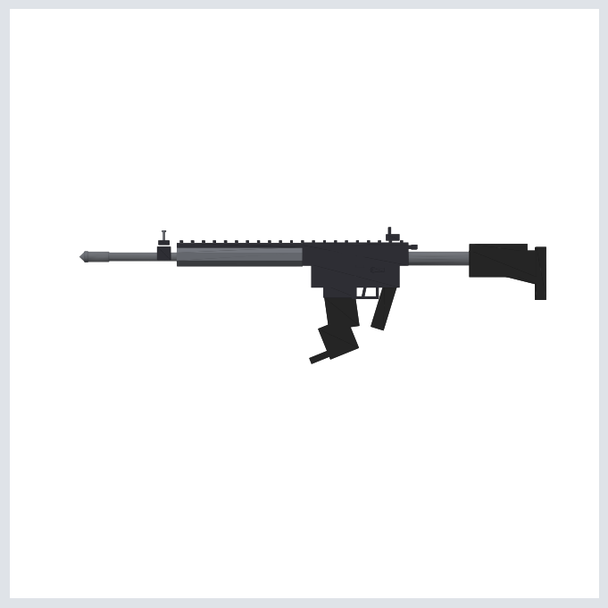

# SM_Rifle — Procedural 3D Rifle for Unreal Engine

A game-ready, AR-15-style rifle blockout generated procedurally with Python.
Low-poly (~1,600 triangles), real-world scale, three PBR material slots.



## Files

| File | Purpose |
|------|---------|
| `SM_Rifle.glb` | glTF binary — **recommended for UE5**, imports with materials |
| `SM_Rifle.obj` | OBJ fallback for UE4 or other DCC tools (Blender, Maya, ...) |
| `generate_rifle.py` | The generator — edit dimensions and re-run to customize |

## Importing into Unreal Engine 5

1. Drag `SM_Rifle.glb` into the **Content Browser** (the built-in *glTF
   Importer* plugin handles it; enable it under **Edit → Plugins** if the
   import dialog doesn't appear).
2. Accept the defaults. You get one static mesh per part group
   (`Receiver`, `Furniture`, `BarrelAssembly`) with these materials:
   - `M_Rifle_Receiver` — anodized black aluminum (metallic 1.0, roughness 0.55)
   - `M_Rifle_Polymer` — matte black polymer (metallic 0.0, roughness 0.85)
   - `M_Rifle_Gunmetal` — smooth gunmetal (metallic 1.0, roughness 0.35)
3. Scale is automatic: the file is authored in meters and UE converts to
   centimeters, so the rifle comes in at its real length of **~106 cm**.

Orientation and pivot:

- The muzzle points **+X** (Unreal's forward axis).
- The origin sits at the **top of the pistol grip**, so the mesh lines up
  naturally when attached to a hand socket (e.g.
  `AttachToComponent(Mesh, ..., "hand_r_socket")`).
- The bore (barrel axis) is at Z ≈ +7 cm above the origin — useful for
  placing a muzzle-flash socket at the barrel tip.

### Using the OBJ instead

OBJ files carry no unit information, so if you import `SM_Rifle.obj` set
**Import Uniform Scale = 100** in the import dialog (meters → centimeters).
Materials come through as basic colors via the bundled `.mtl`.

## Regenerating / customizing

```bash
pip install numpy trimesh
python3 generate_rifle.py .
```

All dimensions are plain numbers (meters) in `generate_rifle.py`. Each part
is one line — move, resize, or delete parts, or add your own with the
`bx()` (box) and `cyl_*()` (cylinder) helpers. Ideas:

- Shorten the barrel and handguard for a carbine/SBR variant.
- Change `baseColorFactor` on `M_Rifle_Polymer` to `[0.42, 0.33, 0.24, 1]`
  for FDE (flat dark earth) furniture.
- Add an optic: a couple of `bx()`/`cyl_x()` parts on top of the rail at
  `z ≈ 0.037`.
