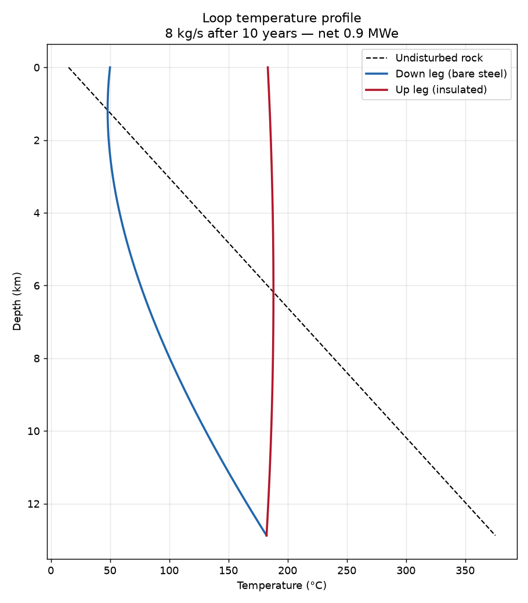
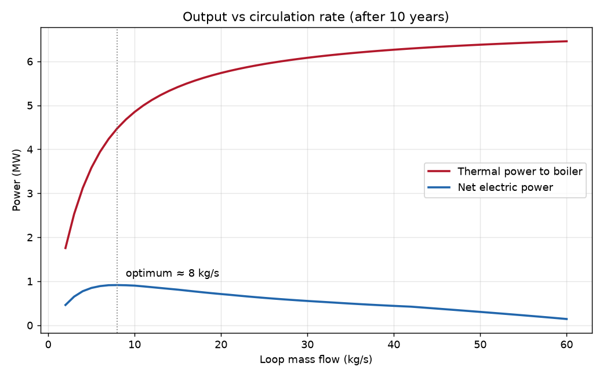
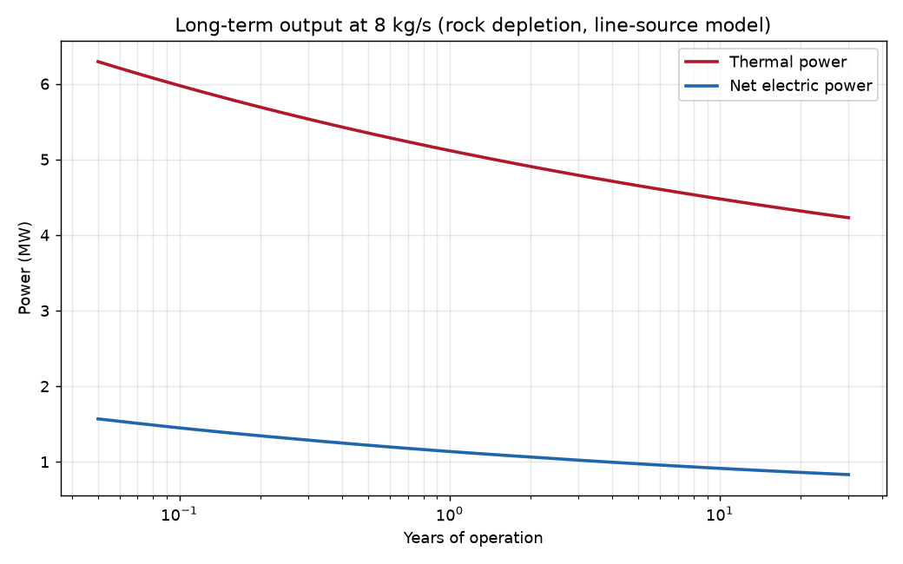
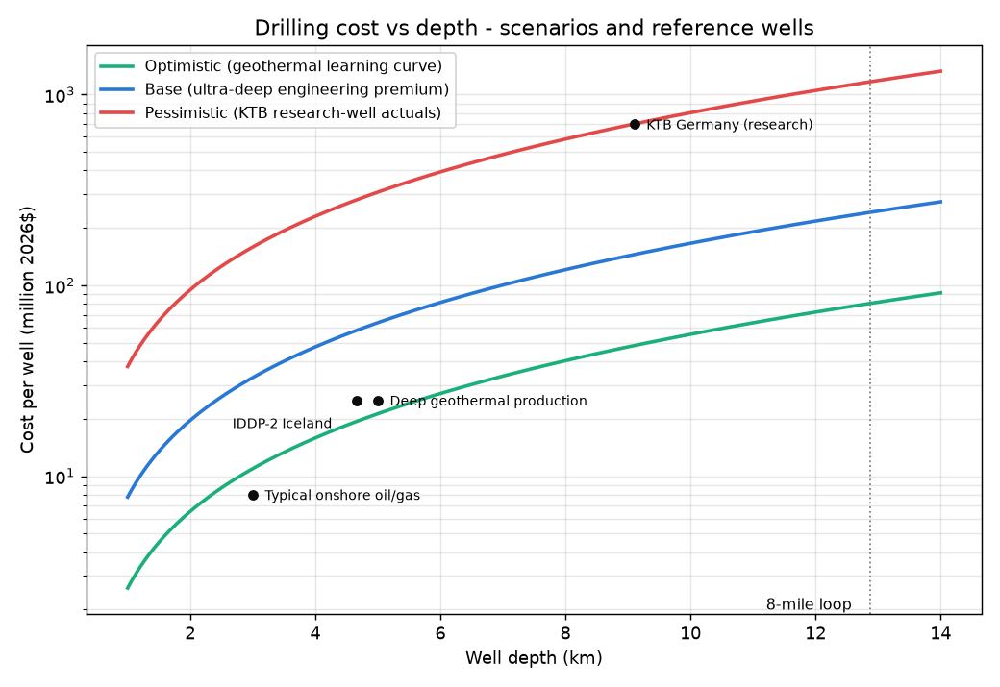
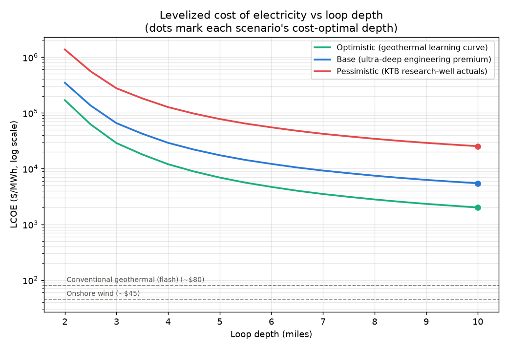
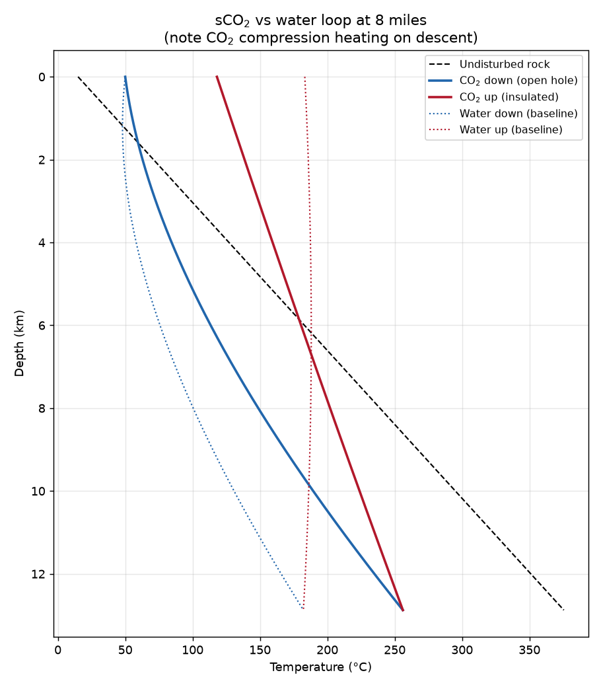
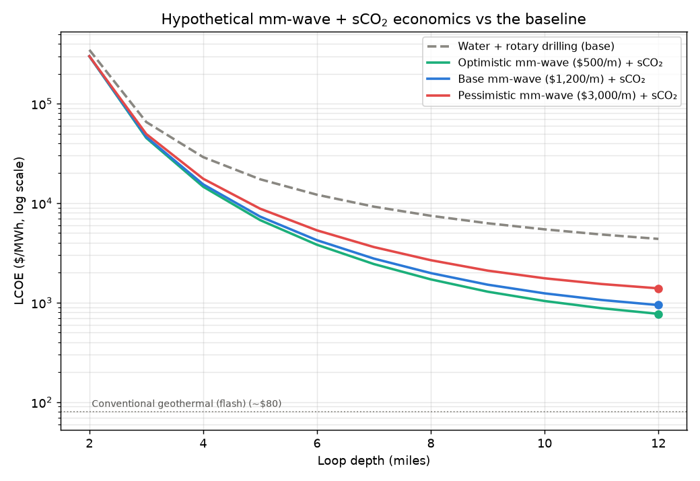
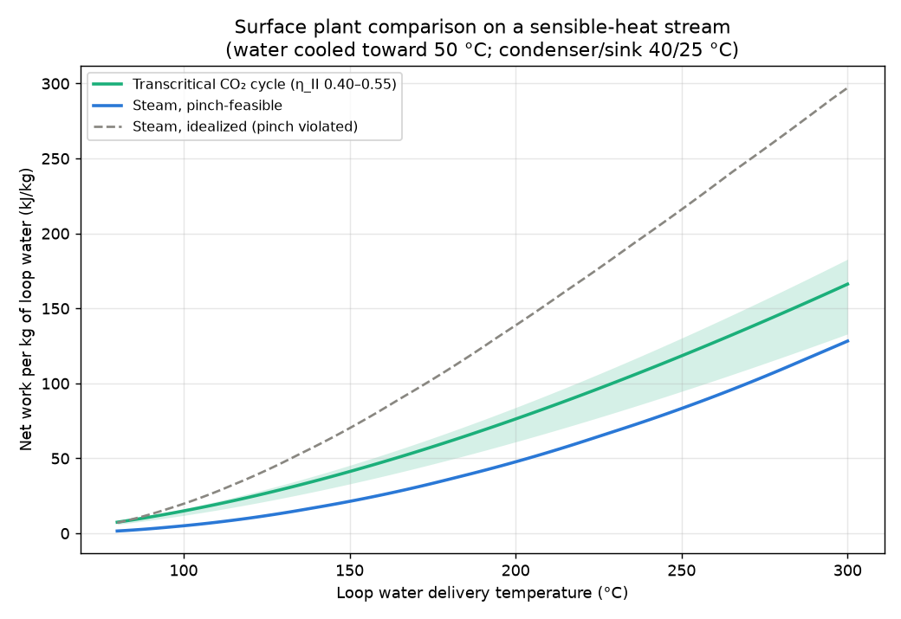
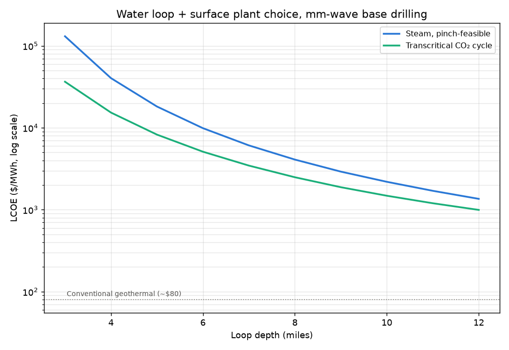

# Deep Closed-Loop Geothermal Ground Heat-Transfer Model

A physics model of an 8-mile-deep (12.87 km) closed loop of 8-inch steel pipe
that harvests geothermal heat and converts it to electricity with a
steam-turbine plant at the surface.

```
   surface heat exchanger (boiler) ──► steam ──► turbine ──► generator
        ▲ hot fluid          │ cooled fluid (re-injected at ~50 °C)
        │                    ▼
   ┌── UP LEG ──┐      ┌── DOWN LEG ──┐
   │ insulated  │      │  bare steel  │   8-inch bore steel pipe
   │ (VIT)      │      │ (heat pickup)│
   └─────┬──────┘      └──────┬───────┘
         └──────── bottom ────┘            8 miles down, rock ≈ 375 °C
```

## What the model captures

| Effect | Method |
|---|---|
| Ground temperature vs depth | Linear geothermal gradient (default 28 °C/km) |
| Rock-to-pipe heat flow & long-term depletion | Transient infinite line-source solution `R_g(t) = [ln(4αt/r²) − γ] / 4πk` |
| Pipe wall / insulation / fluid convection | Series radial resistances; Dittus–Boelter for internal convection |
| Fluid heating along the pipe | Exact exponential march per segment, `T_out = T_g + (T_in − T_g)·e^(−dz/τ)` with relaxation length `τ = ṁ·cp·R` |
| Circulation pressure | Darcy friction (Haaland) **minus thermosiphon buoyancy assist** from the cold-down / hot-up density difference |
| Surface plant | Saturated-steam Rankine cycle from an embedded steam table: pinch-limited boiler, isentropic turbine (η=0.80), 40 °C condenser |

The down leg is bare steel so it picks up heat over its full length; the up
leg is modeled as vacuum-insulated tubing (k ≈ 0.02 W/m·K), which raises its
radial resistance ~11× so the hot fluid arrives at the surface with almost no
loss.

## Running

**Python (full model):**

```bash
pip install numpy matplotlib
python3 geothermal/ground_loop_model.py              # sweep flow, find optimum, plot
python3 geothermal/ground_loop_model.py --mdot 8     # single case
python3 geothermal/ground_loop_model.py --years 30 --gradient 32
```

**Browser (interactive, no install):** open `geothermal/interactive.html` in any
browser — the same physics ported to JavaScript, with live sliders for depth,
gradient, pipe bore, flow rate (with auto-optimization), operating time, and
up-leg insulation. Fully self-contained single file; works offline.

## Headline results (defaults: 28 °C/km, 10 years of operation)

* Rock at 8 miles: **≈ 375 °C**
* Optimal circulation: **≈ 8 kg/s** — a real trade-off: more flow harvests
  more heat but returns it colder, which collapses the steam-cycle efficiency.
* Fluid returns to the surface at **≈ 183 °C**, raising ~1.7 kg/s of steam at
  ~7.5 bar.
* **≈ 4.5 MW thermal → ≈ 0.9 MW net electric** from a single loop.
* The loop is **fully self-circulating**: the thermosiphon head (~59 bar)
  dwarfs the friction drop (~0.7 bar), so no circulation pump power is needed
  (in practice the flow would be throttled to the optimum).
* Output declines slowly (logarithmically) over decades as the rock around
  the borehole depletes — see `results/power_vs_time.png`.





## Drilling cost & economics (`drilling_cost_model.py`)

```bash
python3 geothermal/drilling_cost_model.py                 # 8-mile report + depth sweep
python3 geothermal/drilling_cost_model.py --depth-miles 5
```

Couples a well-cost model to the thermal model to compute capital cost and
LCOE. Drilling cost uses the Lukawski et al. (2014) geothermal well-cost
correlation (inflated to 2026$) under three scenarios, because a 12.9 km
production well is deeper than anything ever drilled (deepest borehole:
Kola SG-3, 12.26 km, 19 years; deepest with public costs: KTB, 9.1 km,
≈$700M in 2026$):

| Scenario | Basis | Per well (12.9 km) | Total capex | LCOE |
|---|---|---|---|---|
| Optimistic | Geothermal learning curve holds to 12.9 km | $81M | $261M | **$2,800/MWh** |
| Base | 3× ultra-deep engineering premium | $242M | $702M | **$7,500/MWh** |
| Pessimistic | Anchored to KTB research-well actuals | $1.17B | $3.24B | **$34,000/MWh** |

(30-year life, 7 % real discount rate, 95 % availability, yearly energy from
the thermal model including rock depletion. Conventional geothermal is
~$80/MWh; utility solar ~$40/MWh.)

**Findings:**

* Drilling dominates everything: the two wells are ~69 % of capital in the
  base case; the steam plant is 0.5 %.
* Within 2–10 miles, **deeper always wins on LCOE** — power grows faster
  than the quadratic cost curve — but even the best case stays ~25× above
  grid parity (see `results/lcoe_vs_depth.png`).
* **Break-even**: to compete at $80/MWh, the *entire project* could cost at
  most ~$4M — roughly $2M per well vs $81M under the optimistic curve. A
  single 8-mile loop producing ~0.9 MWe cannot carry ultra-deep drilling
  costs; the concept needs order-of-magnitude cheaper drilling (e.g.
  energy-beam/millimeter-wave concepts) or many loops (multilaterals)
  sharing one well pair.




## Hypothetical: mm-wave drilling + sCO₂ loop (`mmwave_co2_model.py`)

```bash
python3 geothermal/mmwave_co2_model.py
python3 geothermal/mmwave_co2_model.py --depth-miles 12
```

A what-if variant combining two frontier technologies:

* **Millimeter-wave drilling** (Quaise/MIT gyrotron concept): conventional
  rotary to 3.5 km, then mm-wave with cost ~linear in depth ($500 / $1,200 /
  $3,000 per metre scenarios). The vitrified borehole wall doubles as the
  conduit, so the down leg needs no steel pipe and the rock touches the
  working fluid directly.
* **Supercritical CO₂ working fluid** (CPG-style): the temperature march
  includes gravitational compression heating (`dT/dz = gTβ/cp` ≈ 8–10 °C/km),
  the thermosiphon is computed from the actual density profiles of both
  columns (~144 bar at 8 miles!), and the excess wellhead pressure drives a
  surface turbo-expander in addition to the steam boiler.

**Findings at 8 miles:**

* CO₂ reaches the bottom at 256 °C (vs 182 °C for water — compression
  heating) but expansion cooling on the ascent returns it to the surface at
  only ~118 °C. The 130 bar of excess thermosiphon head yields 0.48 MWe from
  the expander, but the steam cycle is left with an 88 °C boiler and nearly
  collapses. **Net 0.65 MWe — less than the 0.91 MWe water baseline.**
* The LCOE matrix separates the two changes (base cost scenarios):

  |  | Rotary drilling | MM-wave drilling |
  |---|---|---|
  | **Water loop** | $7,463/MWh | $1,419/MWh |
  | **sCO₂ loop** | $10,493/MWh | $1,981/MWh |

  **Millimeter-wave drilling is the technology that matters** (≈5× cheaper
  electricity); in a deep *closed* loop, CO₂ actually hurts, because water's
  thermosiphon is already free circulation and water's high heat capacity
  moves more heat per kg. CO₂'s advantages are strongest in *open* (aquifer)
  systems and shallower wells — not here.
* With linear drilling cost, depth keeps paying: at 12 miles the combined
  system reaches **$771–1,391/MWh** — a ~10× improvement over the baseline,
  but still ~10× above conventional geothermal. The remaining gap is the
  single-loop thermal bottleneck: one borehole pair simply cannot harvest
  enough rock. Multilateral loops sharing the wells are the obvious next
  lever.




CO₂ properties are representative constants (ρ₀ 700 kg/m³, β 3×10⁻³/K,
cp 1.25 kJ/kg·K); a real design study would use a Span–Wagner equation of
state, especially near the critical point.

## Water in the hole, CO₂ in the heat exchanger (`co2_power_cycle_model.py`)

```bash
python3 geothermal/co2_power_cycle_model.py
```

The best-of-both configuration: keep water downhole (free thermosiphon, high
heat capacity) and replace the surface steam boiler with a **transcritical
CO₂ power cycle** fed through the heat exchanger.

**This model surfaced a real flaw in the baseline**: the loop delivers
*sensible* heat (water cooling 186 → 50 °C), but a steam boiler absorbs most
of its heat at one temperature. Checking the baseline boiler against its own
loop stream shows the internal evaporator pinch is badly violated — the loop
water is at ~79 °C where a 168 °C boiler needs ≥ 178 °C. The idealized steam
numbers in `ground_loop_model.py` are therefore **~3× optimistic**; treat
them as an upper bound.

Three surface plants compared on the same 8-mile water loop:

| Plant | T_return | Net power | LCOE (mm-wave base) |
|---|---|---|---|
| Steam, idealized (pinch violated) | 50 °C | ~~0.91 MWe~~ | — (infeasible) |
| Steam, pinch-feasible single-pressure | 116 °C | 0.31 MWe | $4,094/MWh |
| **Transcritical CO₂ cycle in the HX** | **50 °C** | **0.51 MWe** | **$2,492/MWh** |

Why CO₂ wins: supercritical CO₂ at ~200 bar heats up with a temperature
**glide** that parallels the water's cooling curve — no internal pinch — so
it can use the heat all the way down to 50 °C, while the feasible steam
boiler (forced down to a 112 °C boiling point) strands everything below
116 °C. Result: **1.65× the power and ~40 % lower LCOE**, with the CO₂
turbomachinery ~10× smaller than a low-pressure steam turbine ($2,500/kW vs
$3,500/kW assumed). The advantage grows at shallower depths where steam
collapses entirely (see `results/plant_comparison_vs_temp.png`). The CO₂
cycle is modeled by exergy with a second-law efficiency of 0.50 (literature
band 0.40–0.55, carried through the results as an uncertainty band) rather
than a fabricated CO₂ equation of state.

Ranking of the configurations explored so far (8 miles, base costs):

1. Water loop + CO₂ surface cycle + mm-wave drilling — **$2,492/MWh**
2. Water loop + feasible steam + mm-wave — $4,094/MWh
3. sCO₂ downhole + steam + mm-wave — $1,981/MWh *(but uses the idealized
   boiler; feasible-plant correction would raise it)*
4. Anything with rotary drilling at 8 miles — $13,000–34,000/MWh




## Key limitations

* Loop fluid treated as constant-property pressurized liquid water (at
  12.9 km the ~126 MPa hydrostatic pressure keeps it dense; supercritical
  property variation is ignored).
* The two legs are assumed not to thermally interfere through the rock.
* Boiler pinch analysis reduced to fixed hot-end (15 K) and cold-end (10 K)
  approaches; single-pressure saturated cycle (no superheat/reheat).
* No drilling/materials feasibility judgment — 8 miles is roughly the depth
  of the deepest borehole ever drilled (Kola, 12.3 km), and 375 °C exceeds
  common casing/cement ratings. This is a heat-transfer model, not a
  drilling plan.

All physical parameters (gradient, rock properties, insulation, pinch
temperatures, efficiencies) are fields on `Config` in
`ground_loop_model.py` and can be changed in one place.
